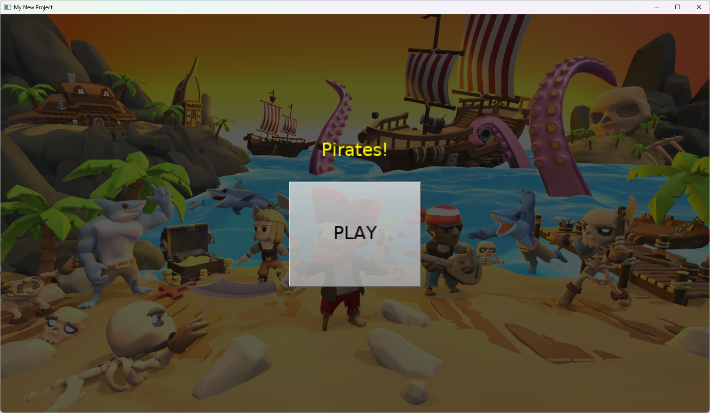
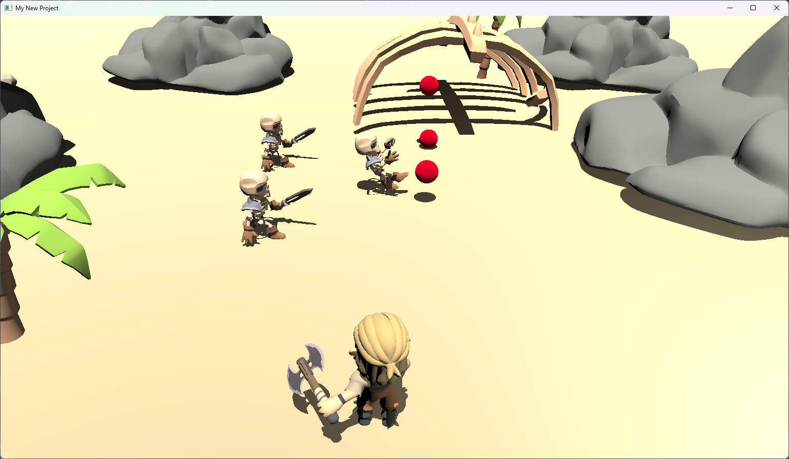
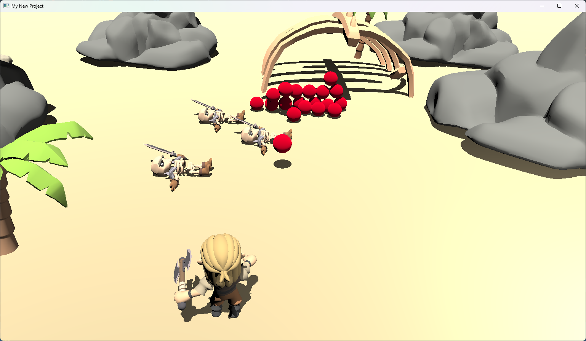

# Pirate shooting balls at skeletons, using physics

The project developed during a presentation [Coding games using Castle Game Engine and Delphi (Dev Days of Summer 2024)](https://www.youtube.com/watch?v=xvAmuPD4PrU).

Download the compiled binaries from [snapshot release](https://github.com/castle-engine/conference-dev-days-summer-2024/releases/tag/snapshot).

## Features shown

- First of all, using [Castle Game Engine](https://castle-engine.io/), our open-source 3D and 2D game engine with comfortable [editor](https://castle-engine.io/editor) and powerful API using [modern Pascal](https://castle-engine.io/why_pascal).

- 2 [views](https://castle-engine.io/views), main menu and game.

- [Viewport with 3D scenes](https://castle-engine.io/viewport_and_scenes) designed in the editor.

- [Handling input](https://castle-engine.io/view_events) in code, to move the player.

- Using [reusable designs](https://castle-engine.io/reuse_design) to define a missile (ball with a `TCastleRigidBody` component.

- Using [TCastleComponentFactory](https://castle-engine.io/apidoc/html/CastleComponentSerialize.TCastleComponentFactory.html) and [TCastleTimer](https://castle-engine.io/apidoc/html/CastleControls.TCastleTimer.html) to spawn the missiles.

- Using [physics](https://castle-engine.io/physics) with collision events to detect when the missile hits the enemy.

- Using [behaviors](https://castle-engine.io/behaviors) to implement simple movement on the enemy.

## Screenshots

## Version at presentation

No cheating, this was created in ~1 hour, from absolute scratch and you can watch how it happened and see all my mistakes on the video!

... after the recording I only did really small stuff:

- reworked `OnCollisionEnter` to use 1 method `SkeletonCollides` for all 3 enemies (during recording I already mentioned this bit of code could be better, I was just in a hurry),
- fixed FPC compatilibity,
- added README and screnshots,
- added `.github` workflow to build the project using [GitHub Actions](https://castle-engine.io/github_actions),
- better colliders, cache to load cliffs faster.

## Authors and license

Code:
- By _Michalis Kamburelis_.
- License: _BSD 3-Clause License_ (see the `LICENSE` file). Basically, do what you want.
- [Support the engine on Patreon](https://www.patreon.com/castleengine)!

Data (all pirate-themed assets):
- By [Quaternius](https://quaternius.com/).
- License: _public domain_. Literally do what you want.
- In this project, we used many assets from his [Pirate Kit](https://quaternius.com/packs/piratekit.html).

    The subdirectory `data/pirates/` in this repo contains a subset of the assets from this pack. We only removed unused assets to minimize [snapshot release](https://github.com/castle-engine/conference-dev-days-summer-2024/releases/tag/snapshot) size. We refer to the assets there from engine design files (`.castle-user-interface`) created using the engine editor.

- [Support the creator on Patreon](https://www.patreon.com/quaternius)!

## Building

Using [Castle Game Engine](https://castle-engine.io/).

Compile by:

- [CGE editor](https://castle-engine.io/editor). Just use menu items _"Compile"_ or _"Compile And Run"_.

- Or use [CGE command-line build tool](https://castle-engine.io/build_tool). Run `castle-engine compile` in this directory.

- Or use [Lazarus](https://www.lazarus-ide.org/). Open in Lazarus `creature_behaviors_standalone.lpi` file and compile / run from Lazarus. Make sure to first register [CGE Lazarus packages](https://castle-engine.io/lazarus).

- Or use [Delphi](https://www.embarcadero.com/products/Delphi). Open in Delphi `creature_behaviors_standalone.dproj` file and compile / run from Delphi. See [CGE and Delphi](https://castle-engine.io/delphi) documentation for details.
