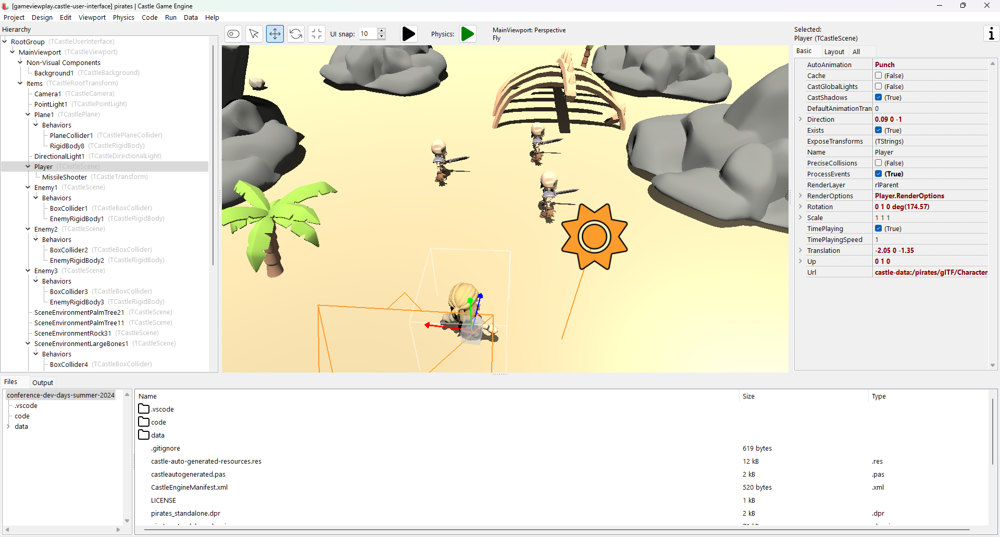

# Demo game made during Dev Days of Summer 2024

The project developed during a presentation _"Coding games using Castle Game Engine and Delphi"_ during https://www.codegear.com/DevDaysofSummer/ .

No cheating, this was created in ~1 hour, from absolute scratch and you can watch how it happened and see all my mistakes on the video!

TODO: Add link to YouTube video etc. when available.

## Screenshots

## Authors and license

Code:
- By _Michalis Kamburelis_.
- License: _BSD 3-Clause License_ (see the `LICENSE` file). Basically, do what you want.
- [Support the engine on Patreon](https://www.patreon.com/castleengine)!

Data (all pirate-themed assets):
- By [Quaternius](https://quaternius.com/).
- License: _public domain_. Literally do what you want.
- In this project, we used many assets from his [Pirate Kit](https://quaternius.com/packs/piratekit.html). The subdirectory `data/pirates/` in this repo contains a copy of the assets, referred to from engine design files (`.castle-user-interface`) setup using the engine editor.
- [Support the creator on Patreon](https://www.patreon.com/quaternius)!

## Building

Using [Castle Game Engine](https://castle-engine.io/).

Compile by:

- [CGE editor](https://castle-engine.io/editor). Just use menu items _"Compile"_ or _"Compile And Run"_.

- Or use [CGE command-line build tool](https://castle-engine.io/build_tool). Run `castle-engine compile` in this directory.

- Or use [Lazarus](https://www.lazarus-ide.org/). Open in Lazarus `creature_behaviors_standalone.lpi` file and compile / run from Lazarus. Make sure to first register [CGE Lazarus packages](https://castle-engine.io/lazarus).

- Or use [Delphi](https://www.embarcadero.com/products/Delphi). Open in Delphi `creature_behaviors_standalone.dproj` file and compile / run from Delphi. See [CGE and Delphi](https://castle-engine.io/delphi) documentation for details.
